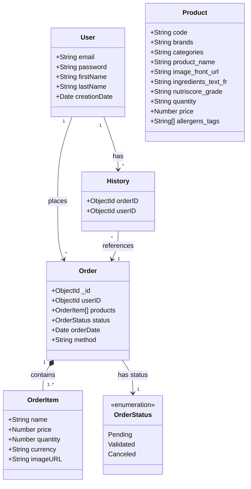
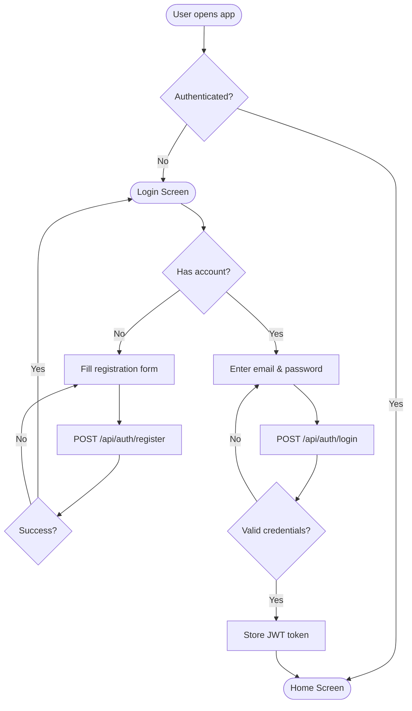
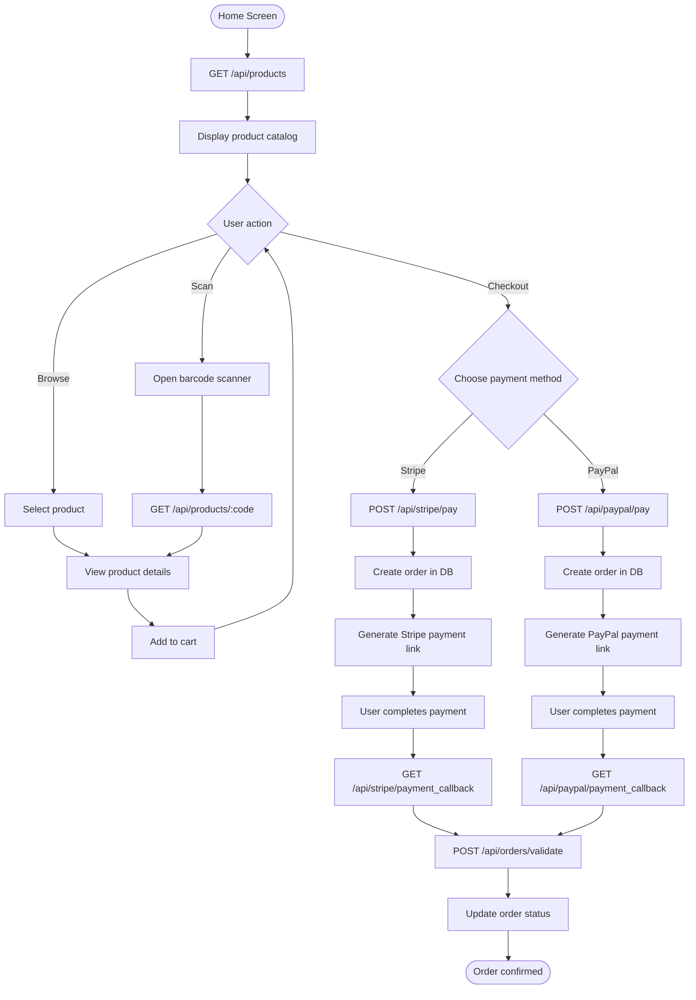
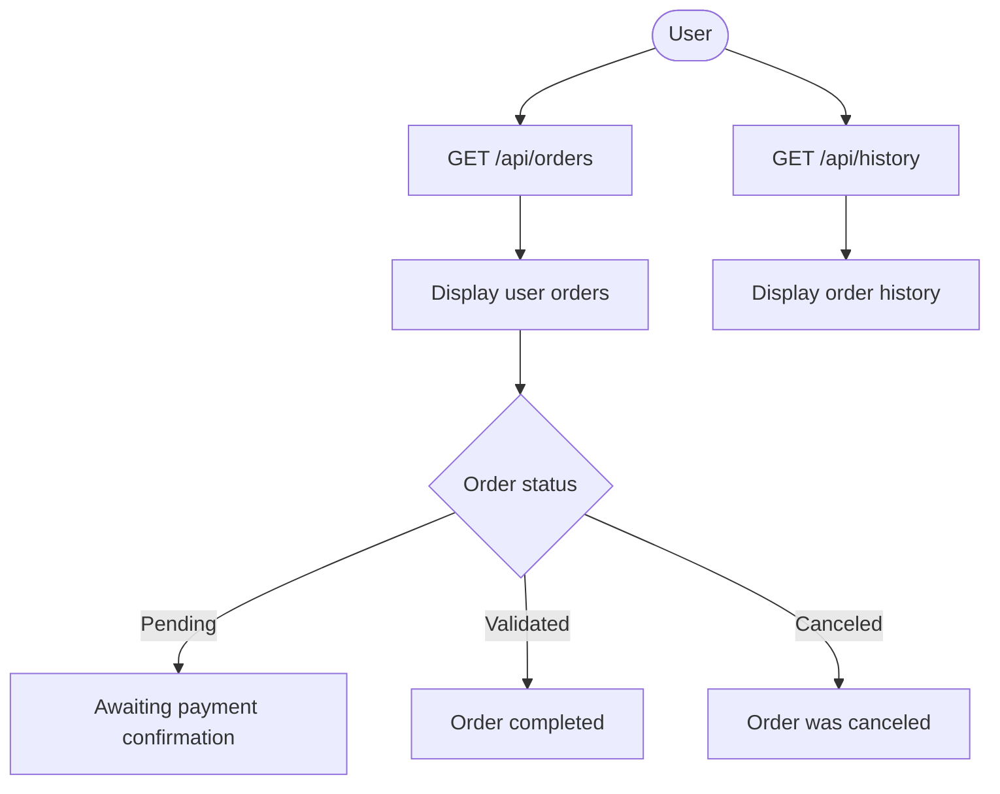

# DEV-801

A mobile food commerce application built as part of the DEV-801 module at Epitech. The project consists of a TypeScript/Express REST API backend and a native iOS application built with SwiftUI.

## Architecture Overview

```
┌──────────────┐         ┌──────────────────┐
│  iOS App     │  HTTP   │  Express API     │
│  (SwiftUI)   │◄───────►│  (TypeScript)    │
│              │  :8080  │                  │
│  - Auth      │         │  - Auth (JWT)    │
│  - Products  │         │  - Products      │
│  - Cart      │         │  - Orders        │
│  - Payment   │         │  - Stripe/PayPal │
└──────────────┘         └────────┬─────────┘
                                  │ Mongoose
                                  ▼
                          ┌──────────────┐
                          │   MongoDB    │
                          │   (mongo:8)  │
                          └──────────────┘
                                  ▲
                                  │ Migration
                          ┌──────────────┐
                          │ OpenFoodFacts│
                          │     API      │
                          └──────────────┘
```

## Tech Stack

| Component | Technologies |
|-----------|-------------|
| **Backend** | Node.js, Express 5, TypeScript, MongoDB (Mongoose), JWT, Stripe, PayPal |
| **iOS** | Swift, SwiftUI, MVVM |
| **Infrastructure** | Docker, Docker Compose |
| **CI/CD** | GitHub Actions |
| **Product Data** | OpenFoodFacts API |

## Project Structure

```
DEV-801/
├── backend/               # Express/TypeScript REST API
├── ios/                   # SwiftUI iOS application
├── .github/workflows/     # CI/CD pipelines
├── docker-compose.yml     # Docker orchestration
└── README.md
```

## Class Diagram

Data structures and their relationships:



## Activity Diagrams

### Authentication Flow



### Product Browsing & Purchase Flow



### Order Management Flow



## Quick Start

### Prerequisites

- Docker & Docker Compose
- Xcode 15+ (for the iOS app)
- pnpm 10+ (for backend development)

### Run the Backend with Docker

```bash
docker compose up --build
```

This starts:
- The **backend** at `http://localhost:8080`
- **MongoDB** at `localhost:27017`

Swagger documentation is available at `http://localhost:8080/docs`.

### Run the Backend in Development Mode

```bash
cd backend
pnpm install
pnpm dev
```

### Run the iOS App

Open `ios/DEV-801.xcodeproj` in Xcode, then run on a simulator or device.

> The iOS app connects to `http://localhost:8080/api` by default.

## CI/CD

- **backend.yml**: automated build and tests on every push
- **mirror.yml**: syncs the `master` branch to a mirror repository
