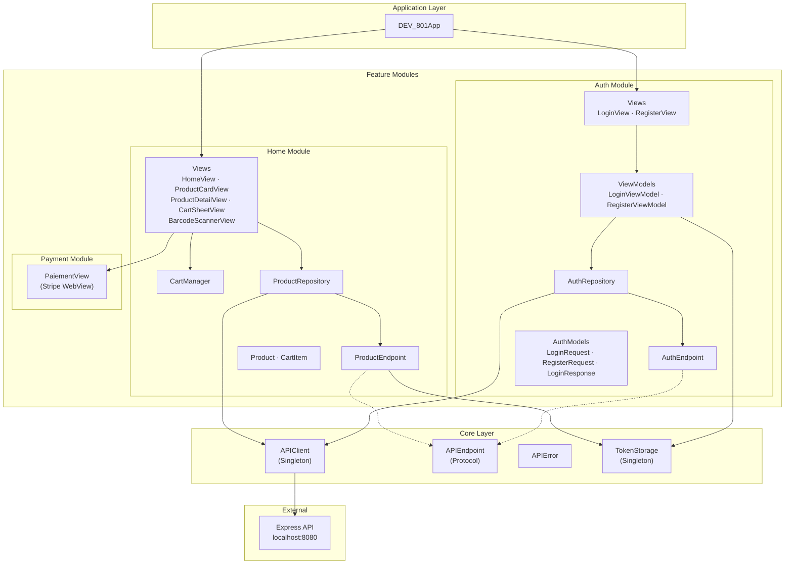
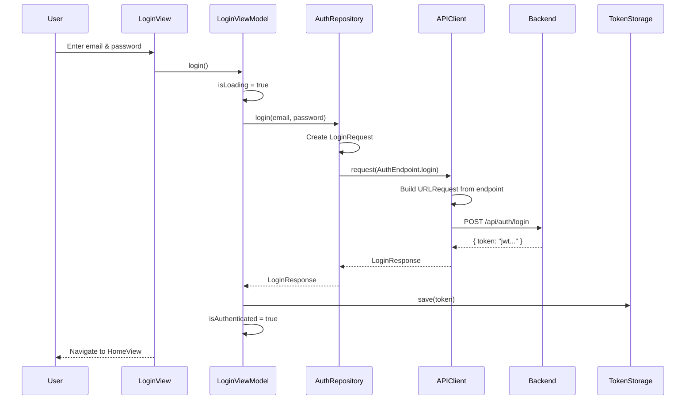
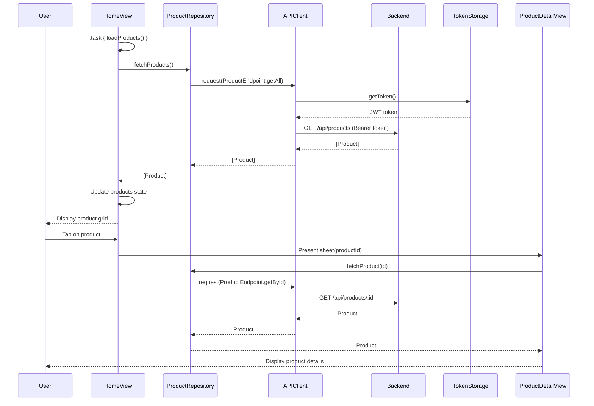
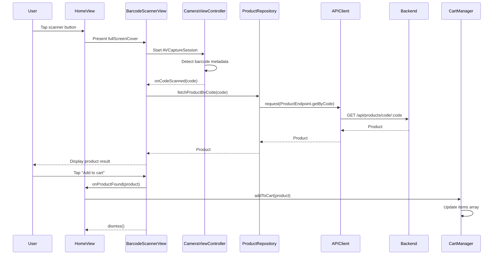
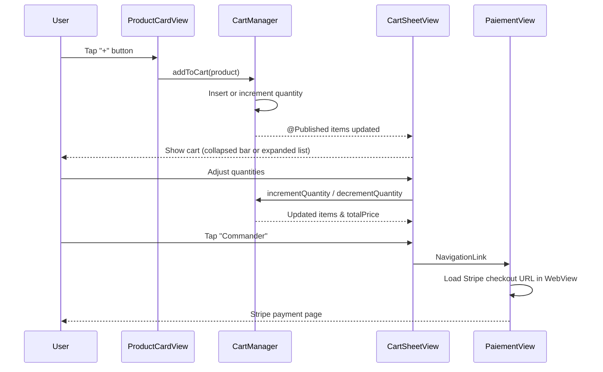

# iOS — DEV-801

Native iOS application built with SwiftUI, allowing users to browse a food product catalog, scan barcodes, manage a shopping cart, and complete payments.

## Tech Stack

| Tool | Purpose |
|------|---------|
| **Swift** | Language |
| **SwiftUI** | UI framework |
| **MVVM** | Architecture pattern |
| **URLSession** | Networking |
| **AVFoundation** | Camera / Barcode scanning |
| **WebKit** | Payment webview (Stripe) |
| **UserDefaults** | Token storage |

## Architecture

The application follows a **layered MVVM architecture** with modular feature organization.



### Layer Responsibilities

| Layer | Responsibility | Key Components |
|-------|---------------|----------------|
| **Application** | App entry point, root navigation based on auth state | `DEV_801App` |
| **Core / Network** | Shared HTTP client, endpoint protocol, error handling, token persistence | `APIClient`, `APIEndpoint`, `APIError`, `TokenStorage` |
| **Module / Data** | Data access, API endpoint definitions, request/response models | `AuthRepository`, `ProductRepository`, `AuthEndpoint`, `ProductEndpoint` |
| **Module / Presentation** | UI and presentation logic, user interaction handling | Views, ViewModels, `CartManager` |

### Key Components

**APIClient** — Singleton HTTP client wrapping `URLSession`. Handles request execution, response validation, JSON decoding (with snake_case conversion), and error mapping. Exposes `request<T: Decodable>()` for typed responses and `requestVoid()` for empty responses.

**APIEndpoint** — Protocol defining `baseURL`, `path`, `method`, `headers`, `body`, and `queryItems`. Each feature module provides its own enum conforming to this protocol (e.g. `AuthEndpoint`, `ProductEndpoint`).

**TokenStorage** — Singleton managing the JWT token in `UserDefaults`. Provides `save(token:)`, `getToken()`, `clear()`, and an `isAuthenticated` computed property.

**CartManager** — `ObservableObject` managing the shopping cart state in memory. Provides add, remove, increment/decrement operations and computed `totalPrice`/`itemCount` properties.

**CameraViewController** — `UIViewController` wrapping `AVCaptureSession` for barcode scanning. Supports EAN-8, EAN-13, UPC-E, Code 128, Code 39, Code 93, and QR codes. Bridged to SwiftUI via `UIViewControllerRepresentable`.

## Data Flow Diagrams

### Authentication Flow



### Product Browsing Flow



### Barcode Scanning Flow



### Cart & Checkout Flow



## Project Structure

```
ios/DEV-801/
├── Application/
│   └── DEV_801App.swift            # Entry point, auth-based navigation
├── Core/
│   └── Network/
│       ├── APIClient.swift         # Shared HTTP client (Singleton)
│       ├── APIEndpoint.swift       # Endpoint protocol definition
│       ├── APIError.swift          # Network error types
│       └── TokenStorage.swift      # JWT token management (Singleton)
├── Modules/
│   ├── Auth/
│   │   ├── Data/
│   │   │   ├── AuthEndpoint.swift      # Login / Register endpoints
│   │   │   ├── AuthModels.swift        # Request / Response models
│   │   │   └── AuthRepository.swift    # Data access layer
│   │   └── Presentation/
│   │       ├── Login/
│   │       │   ├── LoginView.swift
│   │       │   └── LoginViewModel.swift
│   │       └── Register/
│   │           ├── RegisterView.swift
│   │           └── RegisterViewModel.swift
│   ├── Home/
│   │   ├── Data/
│   │   │   ├── CartManager.swift           # Cart state (ObservableObject)
│   │   │   ├── Product.swift               # Product model (Decodable)
│   │   │   ├── ProductEndpoint.swift       # Product API endpoints
│   │   │   └── ProductRepository.swift     # Data access layer
│   │   └── Presentation/
│   │       ├── BarcodeScannerView.swift     # AVFoundation barcode scanner
│   │       ├── CartSheetView.swift          # Cart sheet (collapsible)
│   │       ├── HomeView.swift              # Main screen (product grid)
│   │       ├── ProductCardView.swift       # Product card component
│   │       └── ProductDetailView.swift     # Product detail sheet
│   └── Paiement/
│       └── Presentation/
│           └── PaiementView.swift          # Stripe payment (WebView)
└── Resources/
    └── Assets.xcassets/
```

## Modules

### Auth
Handles login and registration. The JWT token received from the backend is stored locally via `TokenStorage`. App navigation at launch depends on the authentication state (`LoginViewModel.isAuthenticated`).

### Home
Displays the food product catalog fetched from the backend. Features include:
- Browsing products in a grid layout with category filtering and search
- Viewing product details (nutriscore, brand, category, allergens, ingredients)
- Scanning a barcode via the device camera to find a product
- Adding products to an in-memory cart managed by `CartManager`

### Payment
Loads a Stripe checkout page in a `WKWebView` to finalize an order.

## Configuration

The app connects to the backend at `http://localhost:8080/api` by default. To change the URL, edit the `baseURL` property in the `APIEndpoint` protocol extension (`Core/Network/APIEndpoint.swift`).

## Prerequisites

- **Xcode 15+**
- **iOS 17+**
- Backend running locally (see the backend README)

## Running the App

1. Open `ios/DEV-801.xcodeproj` in Xcode
2. Select a simulator or device
3. Run with **Cmd + R**
